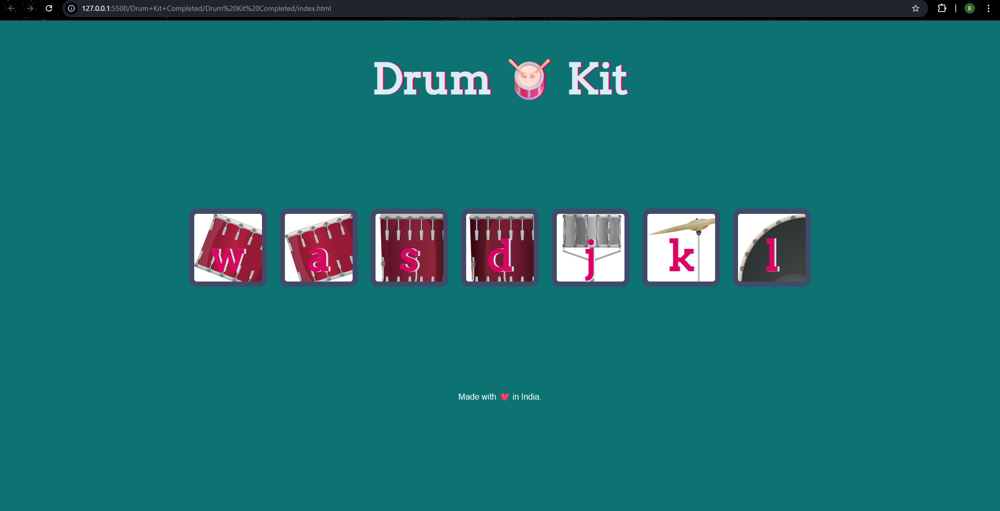

# virtual-drum-kit

# 🥁 Drum Kit

Welcome to **Drum Kit** – a fun and interactive web application where you can play different drum sounds using your keyboard or mouse! Built using **HTML**, **CSS**, and **JavaScript**, this project is perfect for beginners exploring DOM manipulation and audio handling in web development.

---

## 🚀 Demo



> *Click or press keys `W`, `A`, `S`, `D`, `J`, `K`, `L` to play drum sounds!*

---

## 🧠 Features

* 🎹 Play drum sounds with keyboard keys.
* 🖱️ Click buttons to trigger drum beats.
* 💡 Visual animation when a key is pressed.
* 🎨 Custom button styles and shadow effects.
* 🌍 Responsive layout and playful UI.

---

## 🛠️ Tech Stack

* **HTML** – Structure of the page
* **CSS** – Styling and animations
* **JavaScript** – DOM manipulation & sound control

---

## 🎯 How to Use

1. **Clone this repo:**

   ```bash
   git clone https://github.com/your-username/drum-kit.git
   ```
2. **Open `index.html` in your browser.**
3. **Click** the drum buttons or **press keys** (`W`, `A`, `S`, `D`, `J`, `K`, `L`) to hear the sounds!

---

## 📁 Project Structure

```
drum-kit/
│
├── index.html           # Main HTML file
├── styles.css           # CSS styling
├── index.js             # JavaScript logic
├── images/              # Drum button images
│   └── tom1.png ...
├── sounds/              # Drum sound files
│   └── tom-1.mp3 ...
└── README.md            # Project documentation
```

